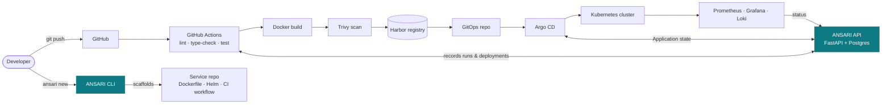
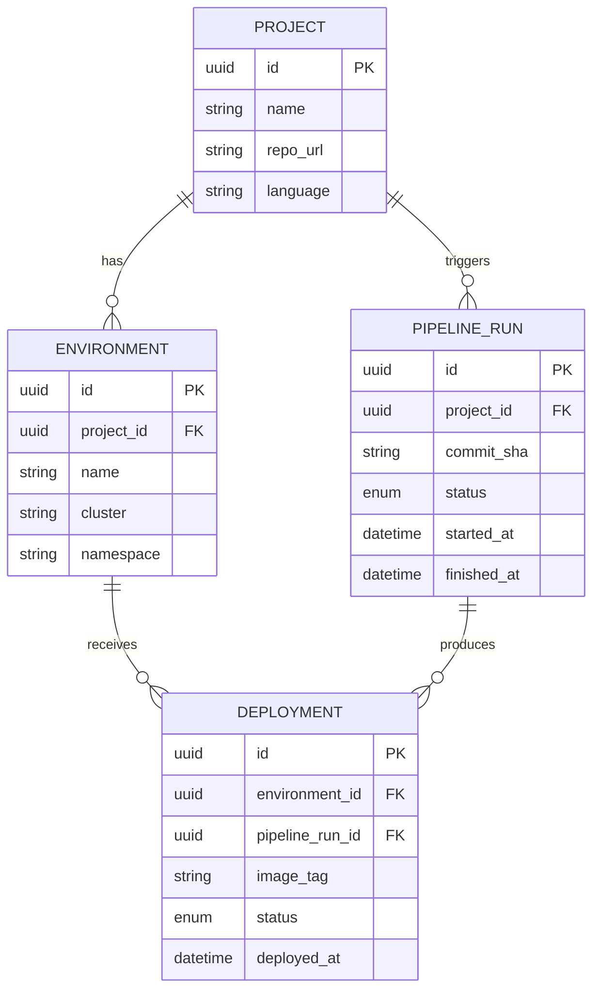
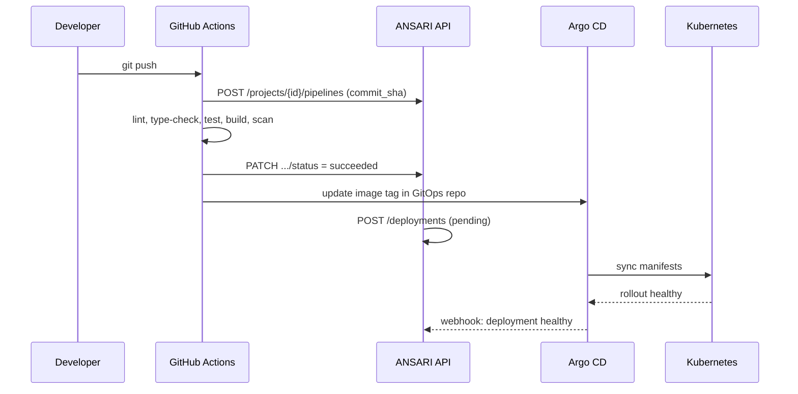

# Architecture

## System overview

ANSARI orchestrates existing open-source tools rather than reimplementing
them. The API and CLI are the only ANSARI-authored components; everything
else in the flow is a standard OSS tool.



**What exists today (v0.1):** `cli`, `api`, `ci` (through the Trivy scan
stage). Everything from `registry` onward is planned (v0.2+).

## API service layout

```
src/ansari/
├── api/
│   ├── main.py        # FastAPI app factory, middleware, structured logging
│   ├── config.py       # pydantic-settings, env-driven
│   ├── db.py           # SQLAlchemy engine/session, declarative Base
│   ├── models.py       # ORM models (Project, Environment, PipelineRun, Deployment)
│   ├── schemas.py      # Pydantic request/response models
│   └── routers/         # one module per resource
└── cli/
    ├── main.py         # Typer app (`ansari new`)
    └── templates/       # Jinja2 templates rendered into scaffolded services
```

Each router owns one resource and talks to Postgres directly through
SQLAlchemy sessions injected via FastAPI's `Depends`. There is no service
layer yet — at this scale it would be indirection without benefit; add one
if/when a router needs logic shared across multiple endpoints.

## Data model



A `PipelineRun` is a single CI execution for a commit; a `Deployment` is
that run's image landing in one `Environment`. This separation is what
makes rollback meaningful — rolling back an `Environment` means pointing it
at a prior `Deployment`, not re-running CI.

## Request flow example

Deploying a new commit to production, end to end:



The last two legs (Argo → API webhook, and the GitOps repo update step) are
v0.3/v0.4 work — today, `PipelineRun` and `Deployment` records exist and can
be created via the API, but nothing yet drives them automatically from a
real GitHub Actions run.

## Why these boundaries

- **ANSARI doesn't run CI itself.** GitHub Actions already does this well;
  reimplementing a job runner would be effort spent on a solved problem
  instead of on orchestration.
- **ANSARI doesn't reconcile Kubernetes state itself.** Argo CD's
  controller loop is the GitOps engine; ANSARI records *what* was deployed
  and *when*, not *how* the cluster converges to it.
- **UUID primary keys, not serial IDs.** Multiple environments and eventual
  multi-tenant use make globally-unique, non-guessable identifiers the
  safer default from day one.
