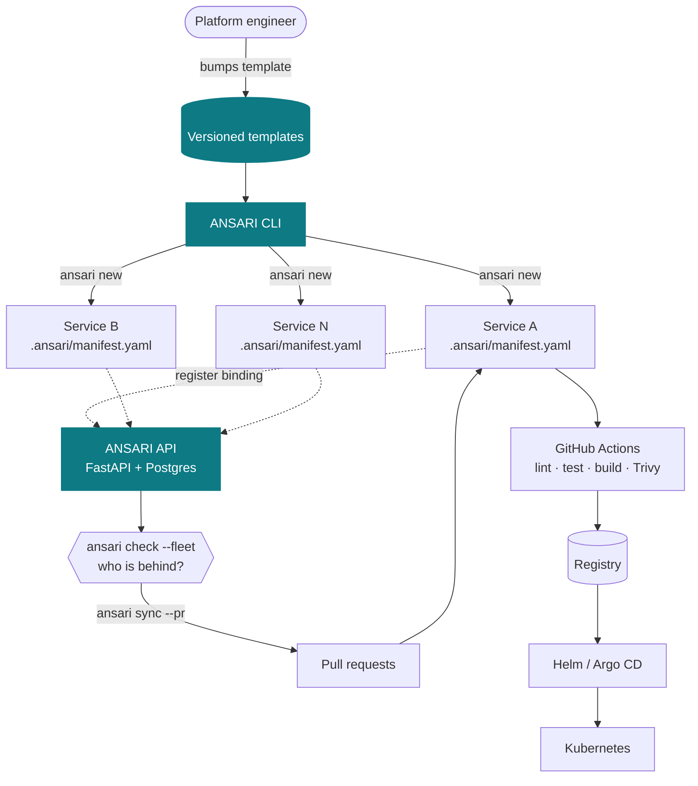
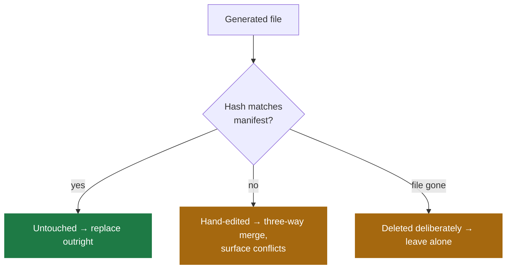
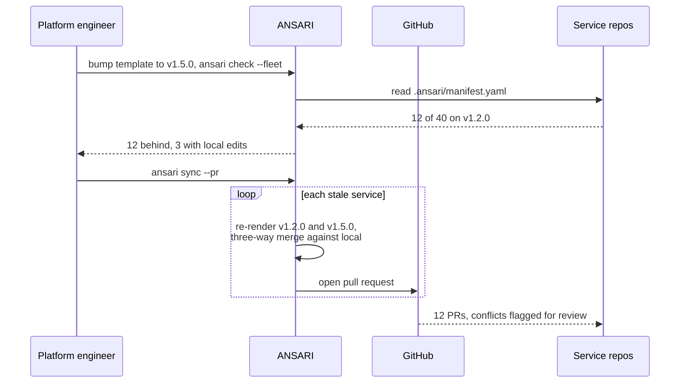
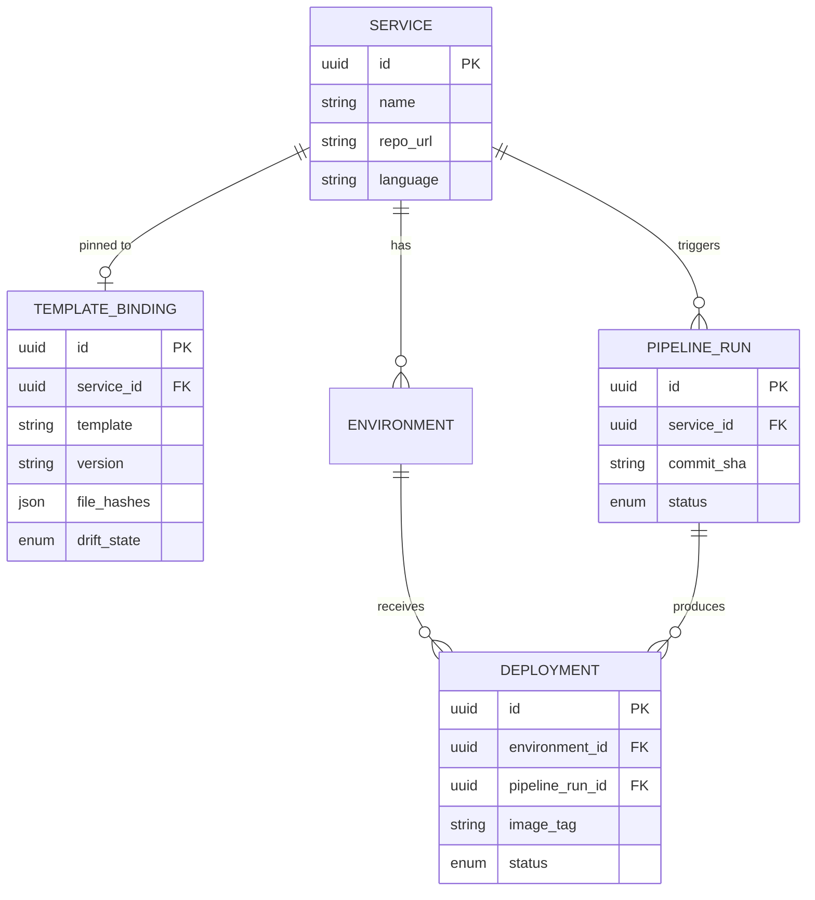
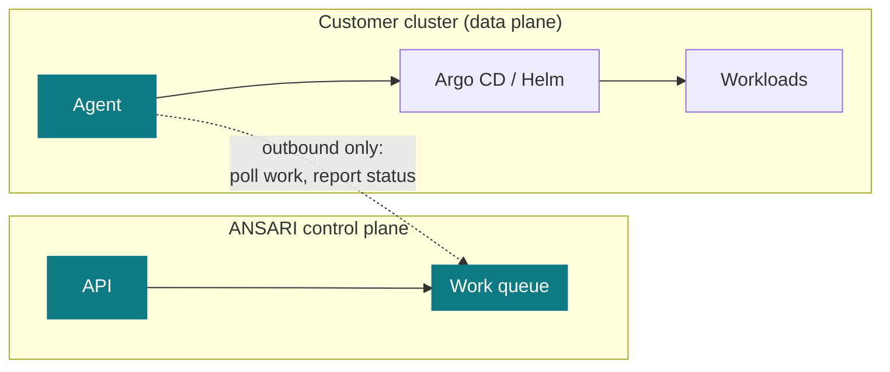

# Design

How ANSARI works, why each boundary is where it is, and what's deliberately
missing. [README.md](README.md) covers what it does and how to run it.

## Overview

ANSARI orchestrates existing tools rather than reimplementing them. The CLI and
API are the only ANSARI-authored components; the paved road they lay down is
made entirely of standard OSS.



**Built:** the CLI, versioned templates, the manifest, single-repo drift
detection, the API, and the generated CI workflow. The registration arrow,
`--fleet`, and everything downstream of `drift` is next — see the roadmap in
[README.md](README.md#roadmap).

Scaffolding itself is a commodity — `cookiecutter`, `create-*`, Backstage
software templates all do it. The unsolved problem is what happens after:
templates change, repos don't follow, and standards decay silently. That's why
drift detection is the product and scaffolding is only the on-ramp.

## The manifest

Everything depends on one idea: **a scaffolded repo remembers where it came
from.** `ansari new` writes `.ansari/manifest.yaml` into the generated repo:

```yaml
template: python-service
version: 1.0.0
rendered_at: 2026-09-06T10:14:00Z
variables:
  name: payment-api
  language: python
  database: postgres
files:
  Dockerfile: sha256:a1b2c3…
  .github/workflows/ansari.yml: sha256:d4e5f6…
```

Three fields, three capabilities:

- **`version`** → is this service behind the current template?
- **`variables`** → the *old* template can be re-rendered identically. That
  reconstruction is the common ancestor a three-way merge needs; without it
  there's no merge, only an overwrite.
- **`files`** → which generated files did a human edit?

### Why per-file hashes

The version alone answers "are you behind?" It cannot answer "is it safe to
overwrite this file?" — and that second question decides whether an automated
upgrade is usable at all.



A tool that clobbers hand-edited files gets uninstalled after the first upgrade.
Being able to say "these three files were edited locally, I won't touch them
without asking" is what makes the write path acceptable — which is why
`ansari check` (read-only) shipped complete before `ansari sync` (writes)
started.

*Trade-off:* reformatting a file reads as a hand-edit. That false positive is
acceptable; silently destroying real edits is not.

### Why it lives in the repo

The manifest is committed to each service repo, not held only in ANSARI's
database:

1. **The CLI works offline.** `ansari check` needs no API, no network, no
   account — a far better first experience than "sign up to see if you're out
   of date."
2. **No lock-in.** Delete ANSARI tomorrow and the repos keep their provenance.
3. **The repo is the source of truth for its own state.** A database record can
   drift from reality; a file beside the code cannot.

*Trade-off:* it can be hand-edited or deleted, so ANSARI must degrade
gracefully when it's missing or malformed rather than assume it's authoritative.
`read_manifest` returns `None` for absent and raises for unreadable — different
situations deserve different messages.

## The upgrade flow



This is why "add SBOM generation everywhere" is one commit plus one `ansari
sync` here, and a quarter of work on a conventional platform. Security scanning
isn't a roadmap phase for the same reason — it's *template content*. The Trivy
step already ships inside the generated workflow.

## Data model



`TEMPLATE_BINDING` is the fleet's cached view of what each repo's manifest says,
so `--fleet` needn't clone forty repos to answer a question. The repo's manifest
stays authoritative; this is a cache.

`PIPELINE_RUN` and `DEPLOYMENT` are separate because that's what makes rollback
meaningful: a run is one CI execution for a commit, a deployment is that run's
image landing in one environment. Rolling back means pointing an environment at
a prior deployment, not re-running CI.

*(The `SERVICE` table is still named `projects` in code — the rename lands with
the next migration.)*

## Layering

Route handlers talk to SQLAlchemy directly through sessions injected via
`Depends`. With five single-resource CRUD routers and no shared logic, a service
layer would be indirection without benefit — adding one "for good architecture"
is cargo cult.

Two foreseeable changes flip that, recorded rather than pre-emptively built:

- **Template work.** Rendering, hashing, and drift detection already live in
  `src/ansari/scaffold/` — pure functions over files, no database, no network.
  Three-way merge and `src/ansari/integrations/` (GitHub API) join them, with
  routers and CLI commands staying thin callers over both.
- **Multi-tenancy.** Tenant scoping cannot depend on every handler remembering
  `WHERE organization_id = ?`; one omission is a cross-customer leak. It needs a
  repository layer enforcing isolation in one place, with Postgres row-level
  security beneath as a second line of defence.

Knowing the trigger in advance is more useful than either adding the layer early
or discovering the need late.

## Boundaries

| Concern | Owner | ANSARI's role |
|---|---|---|
| Running CI | GitHub Actions | Ships and maintains the workflow file |
| Kubernetes reconciliation | Argo CD / Helm | Ships and maintains the chart |
| Image scanning | Trivy | Ships the scan step in the template |
| Metrics and logs | Prometheus / Grafana | Links out; correlates deploys |
| Infrastructure | OpenTofu / Crossplane | Nothing |

Each of those is mature and well-funded. Reimplementing a job runner or a
Kubernetes controller is effort spent on a solved problem instead of the
unsolved one. ANSARI is useless without them and inherits their failure modes —
that's the correct dependency direction for an orchestrator.

Two smaller decisions in the same spirit: **ANSARI never silently overwrites a
file** (a hand-edit is a signal, not a mistake), and **primary keys are UUIDs**
because IDs appear in URLs and sequential integers leak counts and invite
enumeration. Migrating primary keys later is miserable; the larger index is
irrelevant at this scale.

## Designed, not built

If ANSARI deployed to other people's clusters, it must not hold their
credentials. Holding a thousand kubeconfigs makes you a target worth attacking,
and one breach is fatal.



The agent connects **outbound** and pulls work. No inbound ports, no kubeconfig
at rest, no cloud keys in the database. Worst case in a breach is metadata
disclosure — service names, versions, deploy history — not cluster access. This
is the shape Argo CD, Sysdig, and Humanitec converged on, and it cannot be
retrofitted once credentials are already stored.

**Not implemented**, and neither are multi-tenancy, SSO, or billing. Each is a
queue, a polling loop, and token rotation — weeks of well-understood plumbing
that demonstrates nothing this diagram doesn't. Knowing *when* a design decision
must be made is a distinct skill from typing out the implementation, and this
project optimises for the former.

## Known limitations

Listed rather than left to be discovered. Each is a real defect.

| Issue | Impact | Status |
|---|---|---|
| **API is unauthenticated.** Any caller can `DELETE /projects/{id}`. | Not safe to expose; local/self-hosted only. | Out of scope — see *Designed, not built* |
| **`rollback` doesn't roll anything back.** It sets a status field; nothing reconciles. | The endpoint's name overpromises. | Honest until the deploy path exists |
| **Python template only.** | Limits the fleet demo to one language. | Planned |

Fixed in #19: timezone-naive timestamp columns, migrations never asserted
against the models, missing foreign-key indexes, unpaginated list endpoints, a
state-changing value passed as a query parameter, and enum storage that made
direct SQL disagree with the API.

## What was cut

The first roadmap had eight phases covering Kubernetes, GitOps, observability,
security scanning, and infrastructure-as-code. All of it was cut.

It was a **tool tour, not a product** — a list of technologies with a checkbox
each, which produces a project that does nine things shallowly and nothing well.
Breadth is easy to fake and impossible to defend in conversation; depth in one
thing is neither.

Deciding what not to build is the harder engineering skill, and a roadmap with
nothing cut from it hasn't been thought about.
