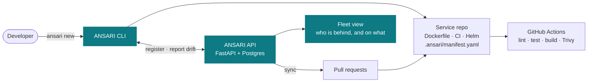

<div align="center">

<picture>
  <source media="(prefers-color-scheme: dark)" srcset=".github/assets/hero-dark.svg">
  <source media="(prefers-color-scheme: light)" srcset=".github/assets/hero-light.svg">
  
</picture>

**Golden paths that don't rot.**

An internal developer platform that scaffolds production-ready services —
then keeps every one of them current as your standards change.

[](https://github.com/sameeralam3127/ansari/actions/workflows/ci.yml)
[](LICENSE)
[](pyproject.toml)

</div>

---

## The problem

A platform team writes a golden template: a hardened Dockerfile, a CI workflow
with vulnerability scanning, a Helm chart with sane resource limits. Forty
services get scaffolded from it. Everyone is happy.

Six months later the template has moved on — a patched base image, a new Trivy
version, an SBOM step — and all forty repos are still on the old one. Updating
them means forty hand-written pull requests, so nobody does it. The paved road
rots, and the platform team's standards become a wiki page nobody reads.

Scaffolding tools generate once and walk away. `cruft` and `copier update` can
re-apply a template, but only to the repo you're standing in — nothing answers
the fleet question: **who is behind, and on what?**

ANSARI treats staying on the paved road as the product, not the setup step.

## How it works

```bash
ansari new payment-api        # scaffold: Dockerfile, CI, Helm chart
ansari check                  # this repo: behind v1.2 → v1.5, 3 files hand-edited
ansari check --fleet          # all services: 12 of 40 are behind
ansari sync --pr              # open a PR on each stale repo
```

Every scaffolded repo carries a `.ansari/manifest.yaml` recording the template
version it came from, the variables it was rendered with, and a hash of every
generated file. That's what makes the last three commands possible — and safe,
since ANSARI can tell a file you hand-edited from one it generated.

```console
$ ansari check payment-api
Template: python-service
Version:  1.0.0 → 1.1.0 (behind)

1 file(s) modified locally:
  Dockerfile

Locally edited files will be three-way merged, never overwritten.
$ echo $?
1
```

`check` exits non-zero on drift, so a service can fail its own CI when it falls
off the golden path.

## Quick start

```bash
git clone https://github.com/sameeralam3127/ansari && cd ansari
uv sync --extra dev

uv run ansari new payment-api        # scaffold a service
cat payment-api/.ansari/manifest.yaml
uv run ansari check payment-api      # verify it's on the golden path

docker compose up --build            # API + Postgres → localhost:8000/docs
```

## Architecture



ANSARI orchestrates existing tools rather than reimplementing them: GitHub
Actions runs CI, Helm and Argo CD handle Kubernetes, Trivy scans images. ANSARI
owns the template lifecycle and the fleet's state.

**[DESIGN.md](DESIGN.md)** covers the manifest format, the upgrade flow, the
data model, why each boundary sits where it does, what's deliberately not built,
and the known limitations.

## Status

| | |
|---|---|
| `ansari new` — scaffold a service | ✅ |
| Dockerfile template — multi-stage, non-root, healthchecked | ✅ |
| CI template — lint → type-check → test → build → Trivy scan | ✅ |
| Helm chart template | ✅ |
| Versioned templates + `.ansari/manifest.yaml` | ✅ |
| `ansari check` — drift detection, CI-friendly exit codes | ✅ |
| REST API — services, environments, pipeline runs, deployments | ✅ |
| `ansari check --fleet` — drift across all services | 🔨 |
| `ansari sync --pr` — three-way merge, fleet-wide upgrade PRs | 📋 |
| Fleet dashboard | 📋 |
| Deploy to `kind` + rollback that actually reverts | 📋 |

In place today: `mypy --strict`, `ruff` lint + format, 34 tests at 92%
coverage, Alembic migrations, structured JSON logging with request IDs,
`/healthz` + `/readyz`, non-root container, Trivy scanning in CI.

**Known limitations are listed honestly** in
[DESIGN.md](DESIGN.md#known-limitations) rather than left for you to discover.
Multi-tenancy, auth, and billing are [designed but deliberately not
built](DESIGN.md#designed-not-built) — this is a personal project, and the
design work is the interesting part.

## Roadmap

| | | |
|---|---|---|
| **v0.2** | Fleet drift — `check --fleet`, API-stored template bindings | 🔨 |
| **v0.3** | Sync — three-way merge, one PR per stale repo | 📋 |
| **v0.4** | Dashboard — fleet health, adoption, scorecards | 📋 |
| **v0.5** | Deploy — `kind`, real pipeline records, working rollback, 2nd language | 📋 |
| **v1.0** | `make demo` — seeds a fleet, drifts it, shows the report | 📋 |

Explicitly out of scope: running CI, reconciling Kubernetes, ingesting
telemetry, provisioning infrastructure, and being a plugin framework. Reasons in
[DESIGN.md](DESIGN.md#boundaries).

## Stack

Python 3.12 · FastAPI · SQLAlchemy 2.0 · Alembic · PostgreSQL · Typer ·
Jinja2 · structlog · pytest · mypy · ruff · Docker · Helm · GitHub Actions ·
Trivy

## Development

```bash
make setup    # install deps + pre-commit hooks
make check    # lint + typecheck + test
```
