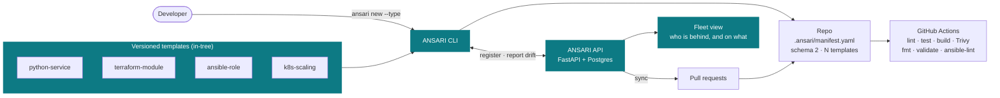
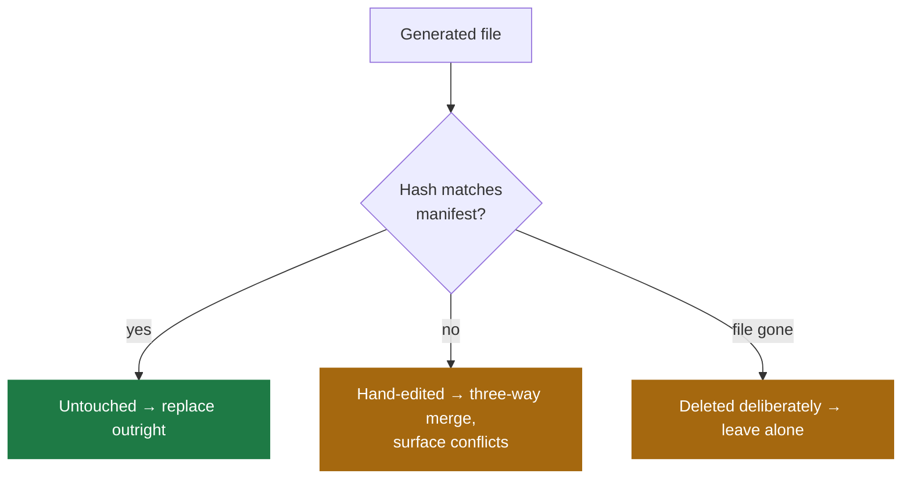
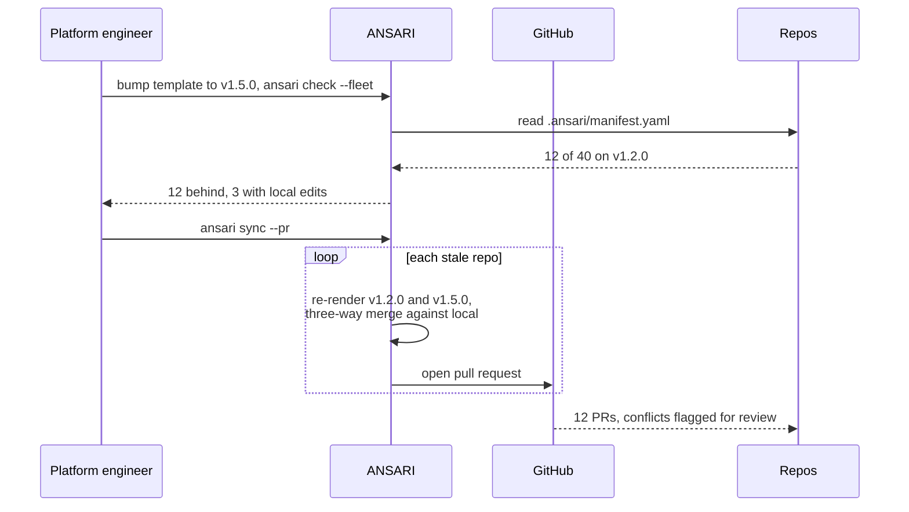
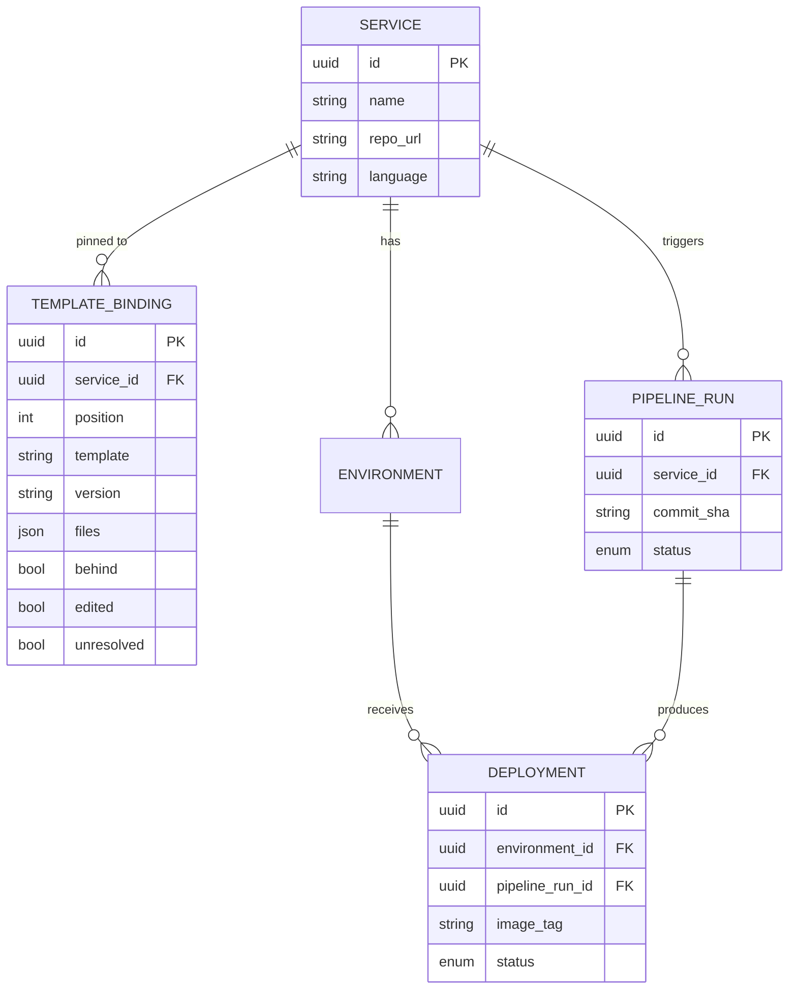

<div align="center">

<picture>
  <source media="(prefers-color-scheme: dark)" srcset=".github/assets/hero-dark.svg">
  <source media="(prefers-color-scheme: light)" srcset=".github/assets/hero-light.svg">
  
</picture>

**Golden paths that don't rot.**

A platform-engineering entry point that scaffolds production-ready services *and*
infrastructure — then keeps every one of them current as your standards change.

[](https://github.com/sameeralam3127/ansari/actions/workflows/ci.yml)
[](LICENSE)
[](pyproject.toml)

</div>

---

## The problem

A platform team writes a golden template: a hardened Dockerfile, a CI workflow
with vulnerability scanning, a Helm chart with sane resource limits. Forty
services get scaffolded from it. Everyone is happy.

Six months later the template has moved on — a patched base image, a new Trivy
version, an SBOM step — and all forty repos are still on the old one. Updating
them means forty hand-written pull requests, so nobody does it. The paved road
rots, and the platform team's standards become a wiki page nobody reads.

The same is true of forty Terraform modules pinned to a provider that has since
gone EOL, and forty Ansible roles whose `meta/main.yml` never gained the
platforms the fleet now runs — usually *more* true, because nobody owns them.

Scaffolding tools generate once and walk away. `cruft` and `copier update` can
re-apply a template, but only to the repo you're standing in — nothing answers
the fleet question: **who is behind, and on what?**

ANSARI treats staying on the paved road as the product, not the setup step.

## How it works

```bash
ansari templates                               # what this build ships
ansari new payment-api --type python-service   # Dockerfile, CI, Helm chart
ansari new vpc --type terraform-module         # module skeleton + validate in CI
ansari attach --type k8s-scaling               # add scaling config to an existing repo

ansari check                  # this repo: behind v1.2 → v1.5, 3 files hand-edited
ansari check --fleet          # all repos: 12 of 40 are behind
ansari sync --pr              # open a PR on each stale repo
```

Every scaffolded repo carries a `.ansari/manifest.yaml` recording the templates
it came from, their versions, the variables they were rendered with, and a hash
of every generated file. That's what makes the last three commands possible —
and safe, since ANSARI can tell a file you hand-edited from one it generated.

```console
$ ansari check payment-api
Template: python-service
Version:  1.0.0 → 1.1.0 (behind)

1 file(s) modified locally:
  Dockerfile

Locally edited files will be three-way merged, never overwritten.
$ echo $?
1
```

`check` exits non-zero on drift, so a repo can fail its own CI when it falls off
the golden path.

## Quick start

```bash
git clone https://github.com/sameeralam3127/ansari && cd ansari
uv sync --extra dev

uv run ansari new payment-api        # scaffold a service
cat payment-api/.ansari/manifest.yaml
uv run ansari check payment-api      # verify it's on the golden path

docker compose up --build            # API + Postgres → localhost:8000/docs
```

## Architecture



ANSARI orchestrates existing tools rather than reimplementing them: GitHub
Actions runs CI, Helm and Argo CD handle Kubernetes, Trivy scans images,
Terraform and Ansible own their own execution. ANSARI owns the template
lifecycle and the fleet's state.

## The manifest

Everything depends on one idea: **a scaffolded repo remembers where it came
from.** `ansari new` writes `.ansari/manifest.yaml` into the generated repo:

```yaml
schema: 2
templates:
  - template: python-service
    version: 1.1.0
    rendered_at: 2026-09-06T10:14:00Z
    variables:
      name: payment-api
      database: postgres
    files:
      Dockerfile: sha256:a1b2c3…
      .github/workflows/ansari.yml: sha256:d4e5f6…
  - template: k8s-scaling
    version: 0.1.0
    rendered_at: 2026-09-14T09:02:00Z
    variables:
      name: payment-api
      max_replicas: 10
    files:
      helm/payment-api/templates/hpa.yaml: sha256:9f8e7d…
```

Four fields, four capabilities:

- **`schema`** → the document shape, so future changes dispatch on a declared
  version instead of guessing from the document's shape.
- **`version`** → is this repo behind the current template?
- **`variables`** → the *old* template can be re-rendered identically. That
  reconstruction is the common ancestor a three-way merge needs; without it
  there's no merge, only an overwrite.
- **`files`** → which generated files did a human edit?

A repo may carry several templates, because a repo often has several
provenances — a service that also owns scaling config is one repo with two. The
composite question, *is this repo, in full, on the golden path?*, is the one the
fleet view has to answer, and a single-template record cannot express it.

Two invariants make that safe:

- **No two templates may claim the same file.** Drift would be undefined and
  `sync` would have two owners for one merge. Enforced on write *and* re-checked
  on read, since the manifest is a file a human can edit.
- **A template ANSARI doesn't recognise is reported, never ignored.** A repo
  scaffolded by a newer ANSARI makes `check` exit non-zero — "I cannot verify
  this repo" is a drift result, not a pass — and makes every write refuse
  outright, because the files owned by an unreadable entry are exactly the ones
  whose ownership can't be checked.

### Why per-file hashes

The version alone answers "are you behind?" It cannot answer "is it safe to
overwrite this file?" — and that second question decides whether an automated
upgrade is usable at all.



A tool that clobbers hand-edited files gets uninstalled after the first upgrade.
Being able to say "these three files were edited locally, I won't touch them
without asking" is what makes the write path acceptable — which is why
`ansari check` (read-only) shipped complete before `ansari sync` (writes)
started.

*Trade-off:* reformatting a file reads as a hand-edit. That false positive is
acceptable; silently destroying real edits is not.

### Why it lives in the repo

The manifest is committed to each repo, not held only in ANSARI's database:

1. **The CLI works offline.** `ansari check` needs no API, no network, no
   account — a far better first experience than "sign up to see if you're out
   of date."
2. **No lock-in.** Delete ANSARI tomorrow and the repos keep their provenance.
3. **The repo is the source of truth for its own state.** A database record can
   drift from reality; a file beside the code cannot.

*Trade-off:* it can be hand-edited or deleted, so ANSARI must degrade
gracefully when it's missing or malformed rather than assume it's authoritative.
`read_manifest` returns `None` for absent, raises for unreadable, and raises a
*distinct* error for a manifest newer than this build — three situations that
deserve three different messages.

**Backward compatibility is unconditional.** Manifests written before multi-
template support have no `schema` key and a scalar `template`/`version` pair.
They are read as a one-entry list and **never rewritten on read**, so a repo
that is only ever checked keeps the exact bytes it was scaffolded with. Their
output is byte-identical to what it was before the change.

## The template descriptor

Each template is a directory of Jinja sources plus a `template.yaml` declaring
its version, the variables it accepts, and where each source lands:

```yaml
name: python-service
version: 1.0.0
variables:
  database:
    type: string          # string | int | bool | list
    default: postgres
    choices: [postgres, none]
files:
  Dockerfile.j2: Dockerfile
  helm/Chart.yaml.j2: helm/{{ name }}/Chart.yaml
```

**Templates declare their own variables.** The alternative — a table of known
options inside the CLI — meant every new template type required editing
`cli/main.py`, which is exactly the special-casing this fork exists to remove.
Adding a template type is now a directory and a descriptor, with no Python
change at all; there is a test that asserts precisely that.

`name` is always supplied by ANSARI and cannot be declared: a template able to
rename its own output would break the destination paths the manifest tracks.
Unknown variables are rejected rather than ignored, so `--var databse=none`
fails loudly instead of quietly scaffolding the default.

### Render modes

A template also decides how each of its files is written:

```yaml
render:
  delimiters: alternate        # ANSARI uses [[ ]] [% %] [# #]; {{ }} passes through
files:
  tasks/main.yml.j2: roles/[[ name ]]/tasks/main.yml
  files/preflight.sh:
    dest: roles/[[ name ]]/files/preflight.sh
    render: copy               # bytes written untouched, never rendered
    mode: "0755"               # quoted: YAML reads an unquoted 0755 as 493
  molecule/molecule.yml.j2:
    dest: roles/[[ name ]]/molecule/default/molecule.yml
    when: with_molecule        # a declared bool; omitted, and untracked, unless true
```

`alternate` exists for output that is itself Jinja. Without it every
`{{ ansible_facts }}` in an Ansible task file would need escaping, and the source a
reviewer reads would stop resembling the file it produces. Comment markers move
too, since a `{# … #}` left alone would be silently eaten.

Every destination is resolved and checked before anything is written: a path
outside the repo, two sources writing one file, or a missing source is refused
with nothing on disk.

## The upgrade flow



This is why "add SBOM generation everywhere" is one commit plus one `ansari
sync` here, and a quarter of work on a conventional platform. Security scanning
isn't a roadmap phase for the same reason — it's *template content*. The Trivy
step already ships inside the generated workflow.

## Why this fork is breadth-first

This is a fork, and it deliberately reverses a decision the upstream project
made. That reasoning is recorded here rather than quietly rewritten.

### The original argument

Upstream's design doc closed with a section called *What was cut*:

> The first roadmap had eight phases covering Kubernetes, GitOps, observability,
> security scanning, and infrastructure-as-code. All of it was cut.
>
> It was a **tool tour, not a product** — a list of technologies with a checkbox
> each, which produces a project that does nine things shallowly and nothing
> well. Breadth is easy to fake and impossible to defend in conversation; depth
> in one thing is neither.
>
> Deciding what not to build is the harder engineering skill, and a roadmap with
> nothing cut from it hasn't been thought about.

That was right for its context, and the rest of the design is better for it. It
is also **not** a claim that breadth is always wrong, nor that infrastructure
scaffolding is uninteresting. Its sharpest point — that security scanning is
*template content*, not a roadmap phase — is kept intact here, and is the reason
this fork can add breadth at all.

### Why this fork reverses it

Upstream is a portfolio project with one template type; a second type exercises
the same manifest and drift classifier twice and adds no new design. This fork's
context is a team whose repos are *not all services*, where:

1. **The drift problem is repo-shaped, not service-shaped.** Restricting the
   tracker to services solves it for a subset of the repos that have it.
2. **One repo needs more than one template, and only one tool can hold that.**
   Split across two tools with two manifest formats, the composite question has
   no owner.
3. **The comparison core was already type-agnostic** — verified against the
   code, not assumed. `check_drift` compares paths to hashes with no extension
   checks or language switch; `TemplateSpec` is sources → destinations. A new
   template type needs no new comparison code.
4. **Depth stays in the same place.** There is no observability phase, no GitOps
   phase, no deploy phase. The eight-phase roadmap is still cut. What is uncut
   is the number of artifact types the *single* mechanism covers.

In short: the original argument cuts breadth *of mechanism*; this fork adds
breadth *of coverage for one mechanism*.

### What it costs

A breadth-first fork that won't name its own costs has made exactly the mistake
that section warns about.

- **Four template types to keep documented, tested, and *current*.** Terraform
  provider releases, Ansible platform matrices, Kubernetes API deprecations,
  Python base images — four treadmills instead of one. A stale template is worse
  than no coverage: it scaffolds bad defaults with an authoritative manifest
  attached, and the fleet view reports everything compliant while it sits on an
  EOL provider. **The failure mode of breadth here is confident wrongness at
  scale.**
- **A manifest schema migration**, changing a format already committed into
  repos. This turned out to be the largest single piece of design work in the
  fork — larger than any template's content.
- **The Jinja-on-Jinja tax.** Every generated file is rendered through Jinja, so
  Jinja-native output (Ansible especially) must escape its own braces. Addressed
  with per-template delimiters, but it costs reviewability on the type where
  review is the only quality gate.
- **Slower velocity on `python-service`**, and a larger onboarding cost — a
  contributor now plausibly needs an opinion about Terraform, Ansible, *and*
  Kubernetes sizing to review a template change competently.

### Tripwires

Concrete signals that this fork got it wrong:

- a template type ships whose generated output wouldn't go to production;
- `sync --pr` still doesn't exist when a fifth template type is proposed;
- any template type acquires a special-cased path in `scaffold/` rather than
  going through the shared abstraction.

**Checked at two points:** after `k8s-scaling` ships and before
`terraform-module` starts, and after `terraform-module` ships and before
`ansible-role` starts. If a tripwire has been crossed, the next template type is
**paused** until the scope is cut back — not noted and continued.

## Boundaries

| Concern | Owner | ANSARI's role |
|---|---|---|
| Running CI | GitHub Actions | Ships and maintains the workflow file |
| Kubernetes reconciliation | Argo CD / Helm | Ships and maintains the chart |
| Image scanning | Trivy | Ships the scan step in the template |
| Metrics and logs | Prometheus / Grafana | Links out; correlates deploys |
| Infrastructure **provisioning** | Terraform / OpenTofu | Ships the module skeleton; never applies it |
| Configuration **execution** | Ansible | Ships the role skeleton; never runs a playbook |

Each of those is mature and well-funded. Reimplementing a job runner or a
Kubernetes controller is effort spent on a solved problem instead of the
unsolved one. ANSARI is useless without them and inherits their failure modes —
that's the correct dependency direction for an orchestrator.

**Explicitly out of scope, including in this wider fork:**

**ANSARI scaffolds and drift-tracks Terraform modules and Ansible roles. It does
not execute `terraform apply` or `ansible-playbook` against live
infrastructure.**

An ANSARI that runs `terraform apply` needs cloud credentials at rest. Holding a
thousand of those makes you a target worth attacking, and one breach is fatal —
a stolen kubeconfig reaches one cluster; stolen cloud credentials reach the
account that *contains* the clusters. This is also the boundary that keeps the
fork cheap: hashing files is one mechanism regardless of what the files
describe, while executing them is state locking, partial applies, and an
entirely separate meaning of the word "drift."

Two clarifications, since ANSARI does generate CI:

- **Generated CI runs credential-free checks** in the consumer's own pipeline
  under the consumer's credentials: `terraform fmt -check`,
  `terraform init -backend=false`, `terraform validate`, `ansible-lint`,
  `yamllint`.
- **`terraform plan` is not enabled by default.** A module is not a root
  configuration, so it cannot plan without a backend and real credentials;
  shipping it enabled would generate a template whose CI fails on first push. It
  ships commented out and labelled, for a consumer with credentials to enable
  deliberately. This *narrows* the boundary rather than reopening it.

Also unchanged: ANSARI does not run CI, reconcile Kubernetes, ingest telemetry,
or act as a plugin framework. Templates ship **in-tree**, reviewed like code — an
out-of-tree registry is how "four types we maintain" becomes "arbitrarily many
nobody maintains."

Two smaller decisions in the same spirit: **ANSARI never silently overwrites a
file** (a hand-edit is a signal, not a mistake), and **primary keys are UUIDs**
because IDs appear in URLs and sequential integers leak counts and invite
enumeration.

## Data model



`TEMPLATE_BINDING` is the fleet's cached view of what each repo's manifest says,
so `--fleet` needn't clone forty repos to answer a question. The repo's manifest
stays authoritative; this is a cache. It is one row *per attached template*, so a repo
carrying two templates has two rows.

`PIPELINE_RUN` and `DEPLOYMENT` are separate because that's what makes rollback
meaningful: a run is one CI execution for a commit, a deployment is that run's
image landing in one environment. Rolling back means pointing an environment at
a prior deployment, not re-running CI.

*(The `SERVICE` table is still named `projects` in code — the rename lands with
the next migration.)*

## Layering

Route handlers talk to SQLAlchemy directly through sessions injected via
`Depends`. With five single-resource CRUD routers and no shared logic, a service
layer would be indirection without benefit — adding one "for good architecture"
is cargo cult.

Rendering, hashing, and drift detection live in `src/ansari/scaffold/` — pure
functions over files, no database, no network. Three-way merge and
`src/ansari/integrations/` (GitHub API) join them, with routers and CLI commands
staying thin callers over both. Multi-tenancy is the change that would force a
repository layer: tenant scoping cannot depend on every handler remembering
`WHERE organization_id = ?`, since one omission is a cross-customer leak.

## Roadmap

| | | |
|---|---|---|
| **v0.2** | Multi-template manifest — schema v2, backward-compatible reader, composite drift | ✅ |
| **v0.3** | Pluggable templates — `--type`, `--var`, template-declared variables | ✅ |
| **v0.3.1** | Render modes — alternate delimiters, verbatim copy, file modes, conditional files | ✅ |
| **v0.4** | `k8s-scaling` sub-template + `ansari attach` | ✅ |
| **v0.5** | `terraform-module` — skeleton, `fmt`/`validate` in CI | ✅ |
| **v0.6** | `ansible-role` — standard layout, `ansible-lint`, optional molecule | ✅ |
| **v0.7** | Fleet drift — `check --fleet` across types and multi-template repos | ✅ |
| **v0.8** | Sync — three-way merge, one PR per stale repo | 📋 |
| **v1.0** | Dashboard + `make demo` — seeds a fleet, drifts it, shows the report | 📋 |

Each milestone ends `mypy --strict` clean, `ruff` clean, and with coverage no
lower than the milestone before it.

## Status

| | |
|---|---|
| `ansari new` — scaffold a service | ✅ |
| Dockerfile template — multi-stage, non-root, healthchecked | ✅ |
| CI template — lint → type-check → test → build → Trivy scan | ✅ |
| Helm chart template | ✅ |
| Versioned templates + `.ansari/manifest.yaml` | ✅ |
| `ansari check` — drift detection, CI-friendly exit codes | ✅ |
| REST API — services, environments, pipeline runs, deployments | ✅ |
| Manifest schema v2 — multiple templates per repo, composite drift | ✅ |
| Backward-compatible v1 reader — existing repos untouched | ✅ |
| Pluggable template abstraction — `ansari new --type`, `--var` | ✅ |
| Templates declare their own variables — no CLI edit per type | ✅ |
| `ansari templates` — list what this build ships | ✅ |
| Render modes — alternate delimiters, verbatim copy, file modes, conditional files | ✅ |
| `ansari attach` — add a template to an existing repo, refusing anything it would overwrite | ✅ |
| `k8s-scaling` template — HPA + PodDisruptionBudget; the autoscaler owns replicas | ✅ |
| `terraform-module` template — aws · google · azurerm, pinned providers, credential-free CI | ✅ |
| `ansible-role` template — ansible-lint production profile, yamllint, optional Molecule | ✅ |
| `ansari check --fleet` — drift across every repo under a directory, summarised by template | ✅ |
| API template bindings — one row per attached template; fleet-wide `GET /template-bindings` | ✅ |
| `ansari sync --pr` — three-way merge, fleet-wide upgrade PRs | 📋 |
| Fleet dashboard | 📋 |

In place today: `mypy --strict`, `ruff` lint + format, 270 tests (API tests run
against real Postgres with the migrations applied), `alembic check` guarding
model / migration drift, structured JSON logging with request IDs, `/healthz` +
`/readyz`, non-root container, Trivy scanning in CI.

## Known limitations

Listed rather than left to be discovered. Each is a real defect.

| Issue | Impact | Status |
|---|---|---|
| **API is unauthenticated.** Any caller can `DELETE /projects/{id}`. | Not safe to expose; local/self-hosted only. | Out of scope — self-hosted only |
| **`rollback` doesn't roll anything back.** It sets a status field; nothing reconciles. | The endpoint's name overpromises. | Honest until the deploy path exists |
| **The Molecule scenario tests one platform** (Ubuntu 24.04), whatever `platforms` lists. | Other distributions aren't exercised. | Deliberate for now |
| **python-service's generated workflow pins outdated GitHub Actions** (checkout v4, setup-uv v3, build-push-action v6; current majors are v7, v10, v7). | New services start on old Actions. | Next python-service bump |
| **Moving an existing repo to python-service 1.1.0 is manual.** Repos on 1.0.0 now report *behind*, and there's no `sync` yet. | Upgrades are hand-applied. | v0.8 |
| **Nothing reports bindings to the API yet.** The table and endpoints exist; `check --fleet` reads repos directly. | The API's fleet view stays empty until something writes to it. | A future `--report` option |
| **Drift tracks file content, not permission bits.** | A `chmod` on a generated file isn't reported. | Deliberate for now |
| **Multi-tenancy, SSO, and billing are not built.** | Single-tenant only. | Deliberate |

## Documentation

| | |
|---|---|
| [docs/architecture.md](docs/architecture.md) | Components, the `new` and `check` flows, manifest and descriptor internals, error types, CI |
| [docs/roadmap.md](docs/roadmap.md) | Versions, dependencies, review checkpoints, standing decisions, what stays out of scope |
| [docs/phases.md](docs/phases.md) | Each milestone: goal, scope, acceptance criteria, and what shipped |

## Stack

Python 3.12 · FastAPI · SQLAlchemy 2.0 · Alembic · PostgreSQL · Typer ·
Jinja2 · structlog · pytest · mypy · ruff · Docker · Helm · GitHub Actions ·
Trivy · Terraform · Ansible

## Development

```bash
make setup    # install deps + pre-commit hooks
make check    # lint + typecheck + test
```

## Contributing

ANSARI is a **learning and educational project** — a reference
implementation of platform-engineering patterns, shared free for anyone to
use, study, fork, and build on. Contributions, issue reports, and questions
are welcome. See:

- [`CONTRIBUTING.md`](.github/CONTRIBUTING.md) — dev setup, PR process,
  branch protection expectations
- [`CODE_OF_CONDUCT.md`](.github/CODE_OF_CONDUCT.md) — community standards
- [`SECURITY.md`](.github/SECURITY.md) — how to report vulnerabilities
  privately (please don't open a public issue for those)

## License

MIT — see [`LICENSE`](LICENSE). Free to use, modify, and redistribute; the
"Known limitations" section above and `SECURITY.md` spell out where extra
care is needed before using this beyond learning/experimentation.
