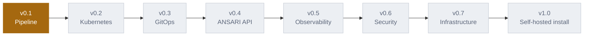

# ANSARI — Roadmap

Phased build plan. Each phase ships a working increment of ANSARI and
tracks the skills it demonstrates — see the checklists below. Check items
off as you complete them.

## v0.1 — Pipeline

- [x] GitHub Actions workflow syntax (jobs, steps, triggers, secrets)
- [x] Writing a CI pipeline: lint → test → build
- [x] Dockerfile authoring (multi-stage builds, layer caching)
- [x] Container vulnerability scanning with Trivy (wired into CI)
- [ ] Reading pipeline logs / debugging failed CI runs

**Outcome:** one application reliably passes through CI on every push.
**Status:** API, CLI, and CI are built and verified locally (migrations
applied against real Postgres, image builds, endpoints exercised). Not yet
exercised through an actual GitHub Actions run.

## v0.2 — Kubernetes

- [ ] Core Kubernetes objects (Pod, Deployment, Service, Ingress)
- [ ] Local cluster tooling (kind or k3d)
- [ ] Helm chart authoring (templates, values, releases)
- [ ] Pushing images to a self-hosted registry (Harbor)
- [ ] Rolling updates and rollbacks via `kubectl`/Helm

**Outcome:** the built image deploys to a local Kubernetes cluster via Helm.

## v0.3 — GitOps

- [ ] GitOps principles (declarative state, git as source of truth)
- [ ] Argo CD installation and Application CRDs
- [ ] Structuring a GitOps repo (per-environment manifests/overlays)
- [ ] Automated sync and drift detection/reconciliation
- [ ] Manual and automated rollback via git revert

**Outcome:** pushing a manifest change to the GitOps repo auto-deploys via Argo CD.

## v0.4 — ANSARI API

- [ ] REST API design (`/projects`, `/pipelines`, `/deployments`, `/environments`, `/releases`, `/rollbacks`)
- [ ] Backend framework proficiency (Go or FastAPI — pick one and commit)
- [ ] PostgreSQL schema design and migrations
- [ ] Integrating with GitHub API, Argo CD API, Kubernetes API from application code
- [ ] Frontend basics (React/Next.js) consuming the API
- [ ] AuthN/authZ for the dashboard

**Outcome:** a working UI/API layer that orchestrates GitHub + Argo CD + Kubernetes.

## v0.5 — Observability

- [ ] Prometheus metrics (scraping, PromQL basics)
- [ ] Grafana dashboard building
- [ ] Centralized logging with Loki
- [ ] Distributed tracing with OpenTelemetry/Jaeger
- [ ] Correlating deployment events with metrics/logs in the UI

**Outcome:** ANSARI's UI shows live operational state per deployment.

## v0.6 — Security

- [ ] SAST integration (Semgrep) in the pipeline
- [ ] SBOM generation
- [ ] Secret scanning
- [ ] Container image signing
- [ ] Enforcing security gates (pipeline fails/blocks deploy above a threshold)

**Outcome:** pipeline actively blocks unsafe builds, not just reports on them.

## v0.7 — Infrastructure

- [ ] OpenTofu (Terraform-compatible IaC, OSS license)
- [ ] Provisioning Kubernetes infra as code
- [ ] State management and plan/apply workflow
- [ ] Environment promotion (dev → staging → production) via IaC

**Outcome:** cluster/infra itself is reproducible from code, not click-ops.

## v1.0 — Self-hosted installation

- [ ] Packaging ANSARI's own components (API, UI, Postgres, Argo CD, Prometheus, Grafana, Loki) for one-command install
- [ ] Writing an `install.sh` / docker-compose or Helm-based installer
- [ ] Documentation for self-hosters (setup, configuration, upgrade path)
- [ ] End-to-end smoke test of a fresh install

**Outcome:** `git clone && ./install.sh` gives someone else a running ANSARI instance.

---

**Stack reference:** GitHub Actions, Docker/Podman, Harbor, Trivy, OpenTofu,
Kubernetes, Helm, Argo CD, OpenBao, Prometheus, Loki, Jaeger/OpenTelemetry,
Grafana, ntfy, Go/FastAPI, React/Next.js.

See [ARCHITECTURE.md](ARCHITECTURE.md) for how the current system fits together.
