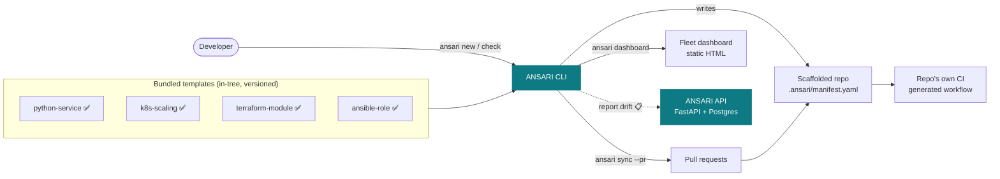
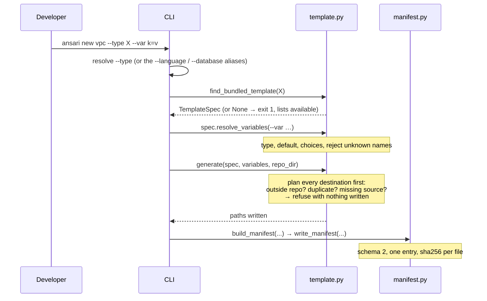
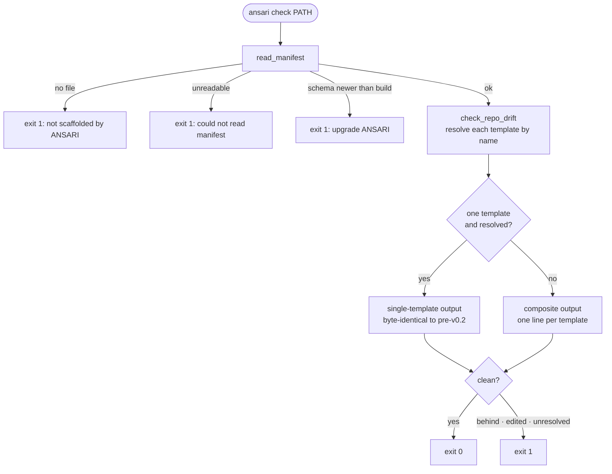
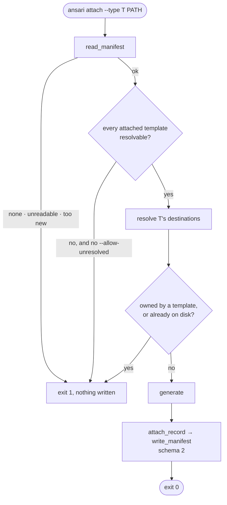
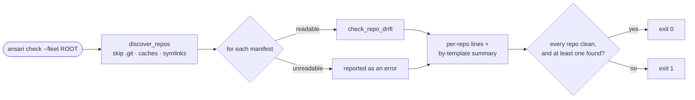
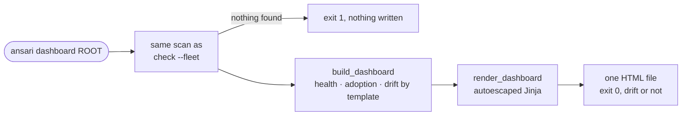
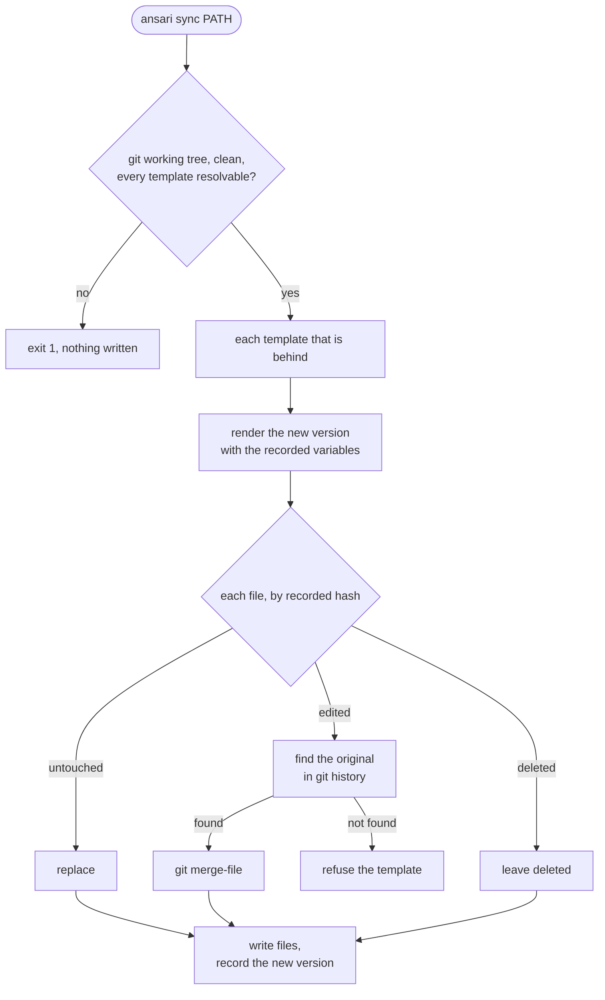
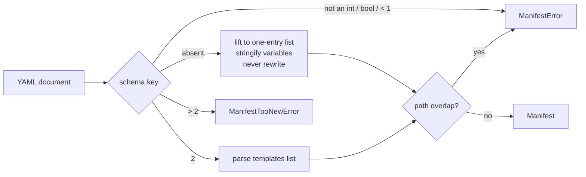
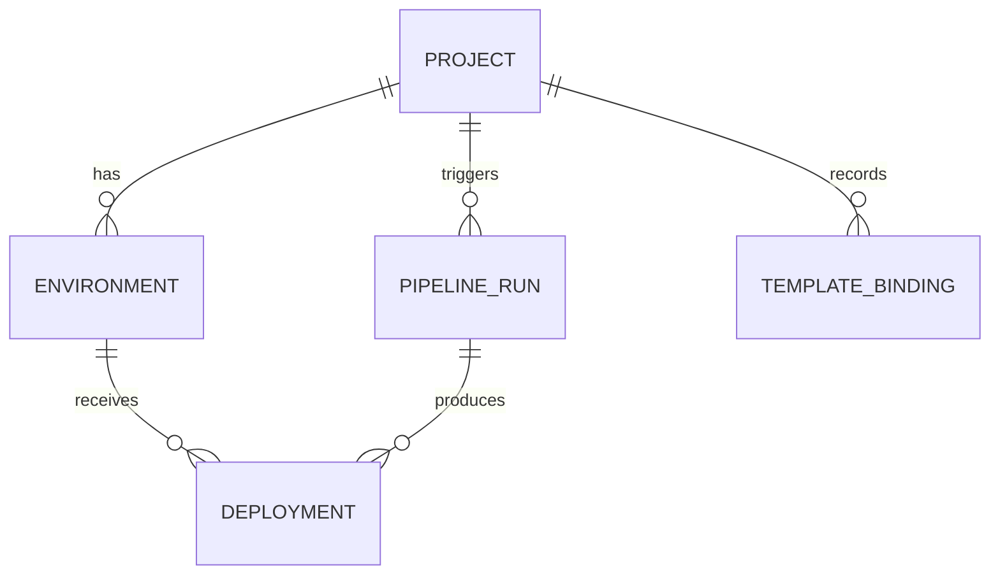
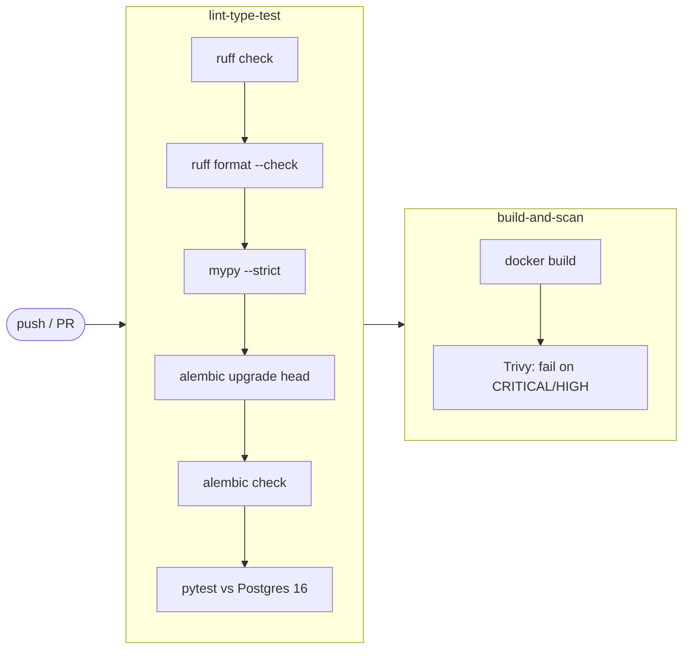

# Architecture

How ANSARI is put together today. For *why* the boundaries sit where they do,
see the [README](../README.md#boundaries); for where this is heading, see
[roadmap.md](roadmap.md).

## System context



Solid arrows exist today. The dotted arrow is planned: nothing reports drift to the
API yet, though the API can store and list template bindings. Fleet drift works
from the CLI (`ansari check --fleet`), and `ansari dashboard` renders the same scan
as a page.

ANSARI orchestrates tools rather than reimplementing them. It **never** runs CI,
reconciles Kubernetes, applies Terraform, or executes Ansible. It writes files,
hashes them, and later compares them.

## Components

| Component | Location | Responsibility |
|---|---|---|
| CLI | `src/ansari/cli/main.py` | Thin Typer front end: `new`, `attach`, `templates`, `check`, `sync`, `dashboard`. Parses arguments, formats output, maps errors to exit codes. |
| Template loading and writing | `src/ansari/scaffold/template.py` | Reads `template.yaml`, validates variables, resolves destinations, renders or copies files. |
| Manifest | `src/ansari/scaffold/manifest.py` | The `.ansari/manifest.yaml` format: schema dispatch, v1 compatibility, path-overlap invariant, writing. |
| Drift | `src/ansari/scaffold/drift.py` | Compares files against recorded hashes, per template and composed across a repo; guards writes. |
| Attach | `src/ansari/scaffold/attach.py` | Adds a template to an existing repo: every refusal checked before any write, then recorded in the manifest. |
| Fleet | `src/ansari/scaffold/fleet.py` | Finds every ANSARI repo under a directory and checks each; summarises by template. |
| Sync | `src/ansari/scaffold/sync.py` | Plans and applies upgrades: replace, three-way merge against git history, or refuse. Local git only. |
| Dashboard | `src/ansari/dashboard/` | Turns a `FleetReport` into page data (health, adoption, drift by template) and renders one self-contained HTML file. Never writes; the CLI does. |
| Demo | `src/ansari/demo/` | `make demo`'s fleet: nine git repos, one per way a fleet drifts, built with the same scaffold functions. |
| GitHub | `src/ansari/integrations/github.py` | Opens pull requests through the `git` and `gh` CLIs. The only code that touches the network. |
| Bundled templates | `src/ansari/cli/templates/<name>/` | One directory per template: Jinja sources plus a descriptor. |
| API | `src/ansari/api/` | FastAPI app: projects, environments, pipeline runs, deployments, health. |
| Persistence | `src/ansari/api/models.py`, `alembic/` | SQLAlchemy 2.0 models on Postgres; schema owned by Alembic migrations. |

**Layering rule:** `scaffold/` works only with files, paths, and local `git`: no
database, no network, and no Typer. Everything that talks to GitHub lives in
`integrations/`. The CLI (and later the API) call into it.
Anything a future `attach` or `sync` needs to write must live in `scaffold/`, not
in the CLI.

```
src/ansari/
├── cli/
│   ├── main.py                 # new · attach · templates · check · sync · dashboard
│   └── templates/
│       ├── python-service/     # template.yaml + Jinja sources
│       ├── k8s-scaling/        # attach-only: HPA, PDB, autoscaling.yaml
│       ├── terraform-module/   # aws · google · azurerm module skeleton
│       └── ansible-role/       # galaxy role, lint configs, optional molecule
├── scaffold/                   # pure: files in, reports out
│   ├── attach.py               # add a template to an existing repo
│   ├── fleet.py                # every repo under a directory
│   ├── sync.py                 # upgrades: replace, merge, or refuse
│   ├── template.py             # descriptor, variables, render modes, generate()
│   ├── manifest.py             # schema v1/v2, invariants, read/write
│   └── drift.py                # per-template + composite drift, write guard
├── dashboard/                  # FleetReport → page data → dashboard.html.j2
├── demo/                       # make demo's fleet, plus python-service 1.0.0's changed sources
├── integrations/
│   └── github.py               # pull requests via git and gh
└── api/
    ├── main.py · config.py · db.py · pagination.py
    ├── models.py · schemas.py
    └── routers/                # health · projects · environments · pipelines · deployments
```

## Flow: `ansari new`



`name` is always supplied by the CLI and can't be declared by a template, because
a template that could rename its own output would break the paths the manifest
tracks.

## Flow: `ansari check`



`check` is **read-only**. It never rewrites a manifest, including a v1 manifest.

## Flow: `ansari attach`



Every refusal happens **before anything is written**, so a refused attach leaves
the repo and its manifest byte-for-byte unchanged. Paths recorded by an
unresolved template still count as owned, even with `--allow-unresolved`.

An attached template renders with the `name` the repo was scaffolded with, not
the directory name, because that's what the existing paths (`helm/payment-api/…`)
were built from.

### The one cross-template contract

python-service's Deployment omits `replicas` while `autoscaling.yaml` exists in
its chart, and k8s-scaling writes exactly that file. Without the contract, every
`helm upgrade` would reset the replica count the autoscaler chose. A test pins
both templates to the same filename.

## Flow: `ansari check --fleet`



Read-only and offline, like single-repo `check`. The summary counts
**attachments** rather than repos, because each attachment can fall behind on its
own. A scan that finds nothing exits non-zero instead of reporting a clean fleet.

## Flow: `ansari dashboard`



Every repo and every attachment is counted once, under its most severe state
(unreadable › cannot verify › behind › edited › current), so each breakdown adds
up to its total. The per-template counts come from `FleetReport.by_template()`
itself, the numbers `check --fleet` prints.

## Flow: `ansari sync`



Planning does all the work, merges included, and a dry run stops there, so it
reports exactly what a real run would do. `--pr` applies only a plan with no
refusals and no conflicts, then commits, pushes, and opens a pull request through
`integrations/github.py`.

## The manifest

### Schemas

| | Schema 1 (pre-v0.2) | Schema 2 (current) |
|---|---|---|
| Marker | no `schema` key | `schema: 2` |
| Templates per repo | exactly one, scalar `template` / `version` | `templates:` list |
| Variables | coerced to strings | `str · int · bool · list[str]` |
| Written by | old ANSARI builds | every write path today |

### Reader dispatch



Resolution works from the recorded **template name**, not the legacy
`variables.language` key. Every manifest ever written records `template:`, so
old repos need no migration. A golden fixture captured before the migration
(`tests/fixtures/manifest_v1_python_service.yaml`) keeps this honest.

### Invariants

1. **No file has two owners.** Enforced when a manifest is written *and* when it
   is read, because the manifest is a file a human can edit.
2. **An unknown template is reported, never ignored.** `check` exits non-zero.
   Every write (`ensure_writable`) refuses, because the files an unreadable entry
   owns are exactly the files whose ownership can't be checked.
3. **Reads never write.** Upgrading a manifest to schema 2 happens only as a side
   effect of a write the user asked for.

## The template descriptor

```yaml
name: role-like
version: 0.1.0
render:
  delimiters: alternate          # jinja (default) | alternate
variables:
  with_molecule: { type: bool, default: false }
files:
  tasks/main.yml.j2: roles/[[ name ]]/tasks/main.yml     # short form
  files/preflight.sh:                                    # mapping form
    dest: roles/[[ name ]]/files/preflight.sh
    render: copy                                         # jinja | copy
    mode: "0755"                                         # quoted octal
  molecule/molecule.yml.j2:
    dest: roles/[[ name ]]/molecule/default/molecule.yml
    when: with_molecule                                  # declared bool
```

| Option | Effect | Validated at load |
|---|---|---|
| `delimiters: alternate` | ANSARI's markers become `[[ ]]` `[% %]` `[# #]`, so `{{ }}` passes through | preset must exist; unknown `render` keys rejected |
| `render: copy` | writes the source's bytes unchanged | mode must be `jinja` or `copy` |
| `mode` | sets permission bits after writing | must be a quoted octal string, since YAML reads `0755` as 493 |
| `when` | generates the file only when the variable is `True` | must name a declared `bool` variable |

`generate()` resolves every destination before writing anything. A destination
outside the repo, one inside `.ansari/`, two sources writing one path, or a
missing source is refused with nothing on disk.

`standalone: false` marks a template that only makes sense added to an existing
repo. `ansari new` refuses it, and `ansari templates` labels it *attach only*.

## Drift classification

For each file an entry records:

| On disk | Classified as | What `sync` does |
|---|---|---|
| hash matches | unchanged | replace outright |
| hash differs | modified | three-way merge, surface conflicts |
| file missing | deleted | leave alone (removed deliberately) |

A template is **behind** when its recorded version differs from the version this
build ships. A repo is **clean** only when no template is behind, no file is
modified or deleted, and nothing is unresolved.

Drift compares **content only**. A `chmod` on a generated file is not reported.

## Error types

| Exception | Raised when | Typical CLI message |
|---|---|---|
| `ManifestError` | manifest malformed, fields missing, paths overlap | "Could not read manifest: …" |
| `ManifestTooNewError` | `schema` is newer than this build | "…upgrade ANSARI to read it" |
| `UnresolvedTemplateError` | a write is attempted onto a manifest with an unknown template | "refusing to write …" |
| `AttachConflictError` | an attach would write over a file another template owns, or an untracked file | "refusing to attach … owned by / not tracked" |
| `TemplateError` | descriptor invalid, destination refused, source missing | the specific cause |
| `VariableError` | caller's `--var` unknown, mistyped, outside `choices`, or missing | the specific cause |

`ManifestTooNewError`, `UnresolvedTemplateError` and `AttachConflictError` subclass `ManifestError`;
`VariableError` subclasses `TemplateError`. A caller that only catches the base
class never leaks a traceback.

## API and data model

Current tables:



- UUID primary keys, timezone-aware timestamps, indexed foreign keys, enums
  stored by value.
- List endpoints are paginated (`limit` / `offset`, capped at 200).
- `TEMPLATE_BINDING` holds **one row per attached template**: a cache of what
  each repo's manifest says, so fleet drift doesn't need to clone every repo. The
  repo's manifest stays authoritative. `PUT /projects/{id}/template-bindings`
  replaces a project's set in manifest order; `GET /template-bindings` lists
  across projects, filterable by template and drift flags. Nothing reports to it
  yet.
- The API is unauthenticated. It's for local or self-hosted use only.

## CI



- API tests **skip locally** when Postgres is unreachable and **fail in CI** if it
  is, so a missing database can never silently remove coverage.
- `alembic check` fails the build if models and migrations diverge.
- **`template-smoke`** scaffolds templates and runs their real tools on the
  output: `terraform fmt`, `init -backend=false` and `validate` (aws),
  `helm lint` / `helm template`, and `ansible-lint` / `yamllint --strict`. A template that renders but wouldn't validate
  fails here rather than in a user's repo.
- Every bundled template's output is pinned per version in
  `tests/fixtures/golden/`. Output that changes without a version bump fails,
  and so does a version with no recorded entry.

## Planned structural changes

| Change | Why | When |
|---|---|---|
| Move templates to `src/ansari/templates/` | the API will read them too; they don't belong to `cli` | housekeeping |
