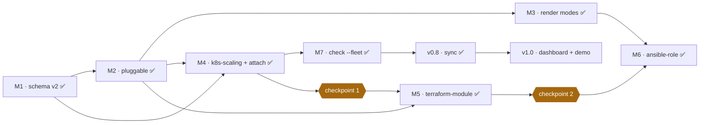

# Roadmap

Where ANSARI is heading and in what order. Each version's detail (scope,
acceptance criteria, what shipped) is in [phases.md](phases.md).

## Versions

| Version | Milestone | Theme | Status |
|---|---|---|---|
| **v0.1** | — | Foundation: API, `ansari new`, `ansari check`, CI with Trivy | ✅ |
| **v0.2** | M1 | Multi-template manifest: schema v2, v1 reader, composite drift | ✅ |
| **v0.3** | M2 | Pluggable templates: `--type`, `--var`, template-declared variables | ✅ |
| **v0.3.1** | M3 | Render modes: alternate delimiters, copy, file modes, conditional files | ✅ |
| **v0.4** | M4 | `k8s-scaling` sub-template + `ansari attach` | ✅ |
| **v0.5** | M5 | `terraform-module` | ✅ |
| **v0.6** | M6 | `ansible-role` | ✅ |
| **v0.7** | M7 | Fleet drift: `check --fleet`, `TEMPLATE_BINDING` per template | ✅ |
| **v0.8** | — | Sync: three-way merge, one PR per stale repo | ✅ built · awaiting merge |
| **v1.0** | — | Dashboard + `make demo` | 📋 next |

## What depends on what

**Why this order:**

- **The schema came first** because every other milestone writes manifests. A
  wrong v1 reader would break every repo already scaffolded, and no amount of good
  template content would make up for that.
- **`k8s-scaling` comes before the heavier template types.** It's the smallest
  real repo with two templates attached: a few files, no new toolchain, no new CI.
  That tests `attach` and composite drift before Terraform and Ansible depend on
  them.
- **Render modes come before `ansible-role`.** Ansible task files are Jinja from
  top to bottom and would otherwise need escaped braces on nearly every line.
- **Fleet drift waits for multi-template repos to exist**, so it's designed
  around real data rather than guesses.

## Review checkpoints

Breadth is the risk this fork accepted. These are the fixed points where that
choice gets rechecked:

| Checkpoint | When | Check |
|---|---|---|
| **1** | after `k8s-scaling` ships, before `terraform-module` starts | re-read the tripwires against what was actually built |
| **2** | after `terraform-module` ships, before `ansible-role` starts | same |

**Tripwires:** any one of these means the breadth call was wrong:

- a template type ships whose generated output wouldn't go to production;
- `sync --pr` still doesn't exist when a fifth template type is proposed;
- a template type needs a special-cased code path in `scaffold/` instead of
  going through the shared descriptor.

If a tripwire has been crossed at a checkpoint, **the next template type is
paused** until the scope is cut back. Noting it and carrying on is not allowed.

**Results so far**

| Checkpoint | Outcome |
|---|---|
| **1** (after `k8s-scaling`) | Passed. Rendering the chart with real Helm caught a replicas defect before it shipped; fixed through a cross-template contract. |
| **2** (after `terraform-module`) | Passed. Real Terraform validated all three providers and caught an indentation bug. The template needed no change to ANSARI's Python code. |

With v0.8 shipped, `sync --pr` exists, so the second tripwire can no longer be crossed.

## Quality bar for every milestone

- `ruff check`, `ruff format --check`, and `mypy --strict` all clean
- coverage of `scaffold/` + `cli/` no lower than the milestone before
- every template's output byte-identical unless its version is bumped (enforced
  by test)
- generated output accepted by the real tool it targets (`terraform`, `helm`,
  `ansible-lint`, `yamllint`), checked in CI's `template-smoke` job
- no breaking change to the public CLI without an explicit decision
- the README and these docs updated in the same change

Coverage so far: 92% (v0.1) → 95% (v0.2) → 96% (v0.3) → 97% (v0.3.1) → 98% (v0.4) → 98% (v0.5) → 98% (v0.6) → 97% (v0.7) → 97% (v0.8).

## Standing decisions

| Decision | Detail | Revisit when |
|---|---|---|
| `--language` / `--database` aliases | kept **indefinitely**, with a warning | python-service is no longer the dominant template type in practice |
| `terraform plan` in generated CI | ships **commented out and labelled** | never by default: a module can't plan without credentials |
| Alternate delimiters | `[[ ]]` `[% %]` `[# #]` | — |
| Sync's merge ancestor | the originally generated file, found in git history by its recorded hash | if templates ever ship their old versions |
| `sync --pr` and conflicts | no pull request while any template is refused or conflicted; conflict markers are never committed | — |
| Terraform provider pins | each provider at its current major: aws `~> 6.0`, google `~> 8.0`, azurerm `~> 5.0` | when a provider ships a new major |
| `k8s-scaling` shape | composable sub-template, versioned independently | — |
| Attach-only templates | `standalone: false` in the descriptor; `ansari new` refuses them | — |
| Who owns replicas | python-service's Deployment omits `replicas` while the chart contains k8s-scaling's `autoscaling.yaml` | if Helm gains a better signal that an autoscaler manages a Deployment |
| Molecule in `ansible-role` | opt-in via `when`, off by default | if the reference roles adopt per-role molecule |
| Templates ship in-tree | reviewed like code, no external registry | — |

## Out of scope, including in this fork

- Running `terraform apply` or `ansible-playbook` against live infrastructure
- Running CI, reconciling Kubernetes, ingesting telemetry
- GitOps / Argo CD management, observability stacks, image registries
- A plugin framework or out-of-tree template registry
- Multi-tenancy, SSO, billing

The original eight-phase plan (Kubernetes → GitOps → Observability → Security →
Infrastructure) remains **cut**. This fork widens what the drift mechanism
covers, not how many mechanisms ANSARI has. See the
[README](../README.md#why-this-fork-is-breadth-first).
